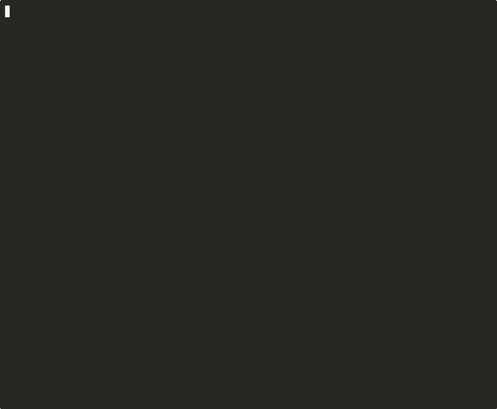

<div align="center">

# Rekindle

[](https://www.npmjs.com/package/rekindle)
[](#tests)
[](LICENSE)

**For Claude Code users who lose time re-explaining project context every session.**

```bash
npx rekindle init
```

*Your AI forgets everything between sessions. Rekindle fixes that.*

</div>

---



Rekindle is an MCP continuity engine that solves **session orientation**, not just storage. Orient at session start, capture at session end. All local, all SQLite, zero API keys.

**v0.2.0** — orientation domain layer, `end_session` tool, typed continuity records. [Release notes](https://github.com/Skitchy/rekindle/releases/tag/v0.2.0)

## Quick Start

Running `npx rekindle init` creates `.rekindle/` in your project with a SQLite database, identity template, and transcript directory. It prints two blocks to copy:

1. **MCP config** — paste into `~/.claude.json` (tells Claude Code where the server is)
2. **Boot instructions** — paste into your project's `CLAUDE.md` (tells the AI how to orient)

Then fill in `.rekindle/identity.md` and start a new Claude Code session.

> Session 1 stores. Session 2 remembers. Session 10 anticipates.

---

## The Problem (43 Sessions of Data)

Over 43 sessions, we measured what an AI assistant failed to load at session start:

| Metric | Value |
|--------|-------|
| Sessions analyzed | 43 |
| Clean boots (all context loaded) | 33% |
| High-signal failures (5+ gaps) | 26% |
| Total retrieval failures | 173 |

Existing memory tools (Mem0, Letta, Zep) optimize for retrieval accuracy: can the AI find what it stored? That's necessary but not sufficient. None of them address whether the AI loaded the *right* context for *this* session, or whether it can detect what it missed.

Rekindle solves session orientation: loading identity, recent context, memory health, and missing-context warnings before the assistant starts work.

See [docs/gap-analysis.md](docs/gap-analysis.md) for the full research dataset.

---

## What It Does

### Boot: orient at session start

`boot_report` runs an orientation pipeline before any work begins:

```
boot_report
  +-- Read identity document (who am I working with?)
  +-- Scan memory stats (what do I know?)
  +-- Find latest checkpoint (where did we leave off?)
  +-- Read last transcript (what actually happened?)
  +-- Detect gaps (what am I missing?)
  +-- Calculate orientation score (how oriented am I?)
  --> "Carrying forward: [context loaded, gaps identified, score: 80/100]"
```

**Healthy output:**

```
## Orientation Score
100/100

+20  Identity document loaded
+20  Recent checkpoint exists
+20  Session transcript found
+20  Recent memories exist (last 7 days)
+10  Relationship/preference memories populated
+10  Project-scoped memories found
```

**Sparse output (flags what's missing):**

```
## Gaps Detected
- [critical] identity_missing: No identity document found
- [warning] checkpoint_missing: No recent checkpoint

## Orientation Score
20/100

 ✗  Identity document loaded (20pts)
 ✗  Recent checkpoint exists (20pts)
 ✗  Session transcript found (20pts)
+20  Recent memories exist (last 7 days)
 ✗  Relationship/preference memories populated (10pts)
 ✗  Project-scoped memories found (10pts)
```

### Capture: close the loop at session end

`end_session` stores structured continuity records — not just a summary:

| Field | What it captures |
|-------|-----------------|
| `checkpoint` | Where we left off (required) |
| `decisions` | What was decided and why |
| `open_loops` | Unresolved tasks or questions |
| `constraints` | Boundaries that must not be violated |
| `relational_delta` | What changed in the working relationship |
| `next_session_focus` | Where to resume next session |
| `preferences` | New user preferences learned |
| `warnings` | Things next session should watch for |

All records stored with `type`, `source`, and `session_id` metadata. Next `boot_report` loads the checkpoint automatically.

### Between sessions: search and manage

| Tool | Description |
|------|-------------|
| `store_memory` | Store with content, category, importance (1-10), and project scope |
| `search_memory` | Full-text search with BM25 ranking, boosted by importance |
| `list_memories` | Browse memories, newest first. Filter by category or project |
| `delete_memory` | Delete by ID |
| `update_memory` | Update content, category, or importance |

**Categories:** `preference` `lesson` `context` `relationship` `general`

---

## Why not just CLAUDE.md?

A static file is passive. Your AI reads it, but it can't search it, rank it, track what's been retrieved, or tell you what's missing. Rekindle adds:

- **Search** — full-text with importance-weighted ranking
- **Structure** — category and project scoping across memories
- **Orientation** — proactive context loading at boot, not just on-demand retrieval
- **Gap detection** — flags missing identity, empty categories, stale data
- **Scoring** — transparent checklist so you know *how oriented* the AI is
- **Session capture** — structured close with checkpoints, decisions, and open loops

---

## v0.2.0 Highlights

- **7 MCP tools** — added `end_session` for structured session close
- **Orientation domain layer** — `boot_report` is now a thin wrapper; all logic in `OrientationService`, `GapDetector`, `Scorer`
- **Typed continuity records** — memories carry `type`, `source`, `session_id` instead of content prefixes
- **Orientation scoring** — 100-point additive checklist across 6 criteria
- **Structured gaps** — `{ code, severity, message }` with 8 gap codes
- **64 automated tests** — unit, integration, and performance

---

## Install from Source

```bash
git clone https://github.com/Skitchy/rekindle.git
cd rekindle
npm install
npm run build
node dist/init/cli.js init
```

<details>
<summary><strong>Session Hooks</strong></summary>

Two optional Python hooks for Claude Code (stdlib only, zero external dependencies):

**extract-session.py** (Stop hook): Extracts a Markdown transcript from the session JSONL when a session ends.

**pre-compact-capture.py** (PreCompact hook): Saves the last 80 messages before context compaction.

```json
{
  "hooks": {
    "Stop": [{
      "type": "command",
      "command": "python3 /path/to/rekindle/hooks/extract-session.py"
    }]
  }
}
```

| Variable | Default | Description |
|----------|---------|-------------|
| `REKINDLE_TRANSCRIPT_DIR` | `.rekindle/transcripts/` | Where transcripts are saved |
| `REKINDLE_SESSIONS_DIR` | Auto-detected | Claude Code sessions directory |
| `REKINDLE_HUMAN_NAME` | `Human` | Name for human messages |
| `REKINDLE_AI_NAME` | `Assistant` | Name for AI messages |
| `REKINDLE_TIMEZONE` | `UTC` | Timezone for timestamps |

</details>

<details>
<summary><strong>Privacy and Security</strong></summary>

- **All data is local.** Nothing is sent to external servers.
- **No network calls.** The MCP server communicates via stdio. No HTTP, no telemetry, no analytics.
- **Transcripts contain conversation text.** Do not enable transcript capture if your sessions contain secrets or credentials.
- **Transcript capture is optional.** The hooks are not installed by default.
- **SQLite database is a regular file.** Not encrypted. Use OS-level disk encryption if needed.
- **`.rekindle/` is gitignored.** The init command handles this automatically.
- **boot_report reads local files.** Paths are not sandboxed. Only use with MCP clients and prompts you trust.

</details>

<details>
<summary><strong>Compatibility</strong></summary>

| Environment | Status |
|-------------|--------|
| Claude Code (macOS) | Supported, tested |
| Claude Code (Linux/WSL2) | Supported, tested |
| Claude Code (Windows) | Supported, tested |
| Claude Desktop | Untested (uses same MCP protocol) |
| Cursor, Continue, Cline | Untested (should work if they support MCP stdio) |

</details>

<details>
<summary><strong>Architecture</strong></summary>

```
rekindle/
  src/
    index.ts          MCP server entry point
    server.ts         Server setup, tool registration
    storage/
      sqlite.ts       SQLite + FTS5, schema migration, sessions
    orientation/
      types.ts        OrientationResult, Gap, ScoreItem
      GapDetector.ts  Structural gap detection (8 codes)
      Scorer.ts       Orientation scoring (6 criteria, 100pts)
      OrientationService.ts   Orchestrator
      OrientationRenderer.ts  Markdown + JSON output
    tools/
      boot-report.ts  Thin wrapper over OrientationService
      end-session.ts  Structured session close
      store.ts search.ts list.ts delete.ts update.ts
    init/
      cli.ts scaffold.ts templates/
  hooks/
    extract-session.py
    pre-compact-capture.py
```

**Storage:** SQLite + FTS5 via `better-sqlite3`. BM25 ranking boosted by importance. Typed records with `type`, `source`, `session_id`.

**Transport:** stdio (standard MCP). Works with Claude Code out of the box.

</details>

## Tests

```bash
npm test
```

64 tests: storage CRUD + FTS5 ranking, orientation domain (gap detection, scoring, service, rendering), MCP integration (all 7 tools), and performance (1000-memory search under 100ms).

## Roadmap

**v0.3: "It thinks in networks"** — Spreading activation, semantic search via embeddings, open loops in boot reports, gap analysis tooling, eval harness.

## License

MIT
